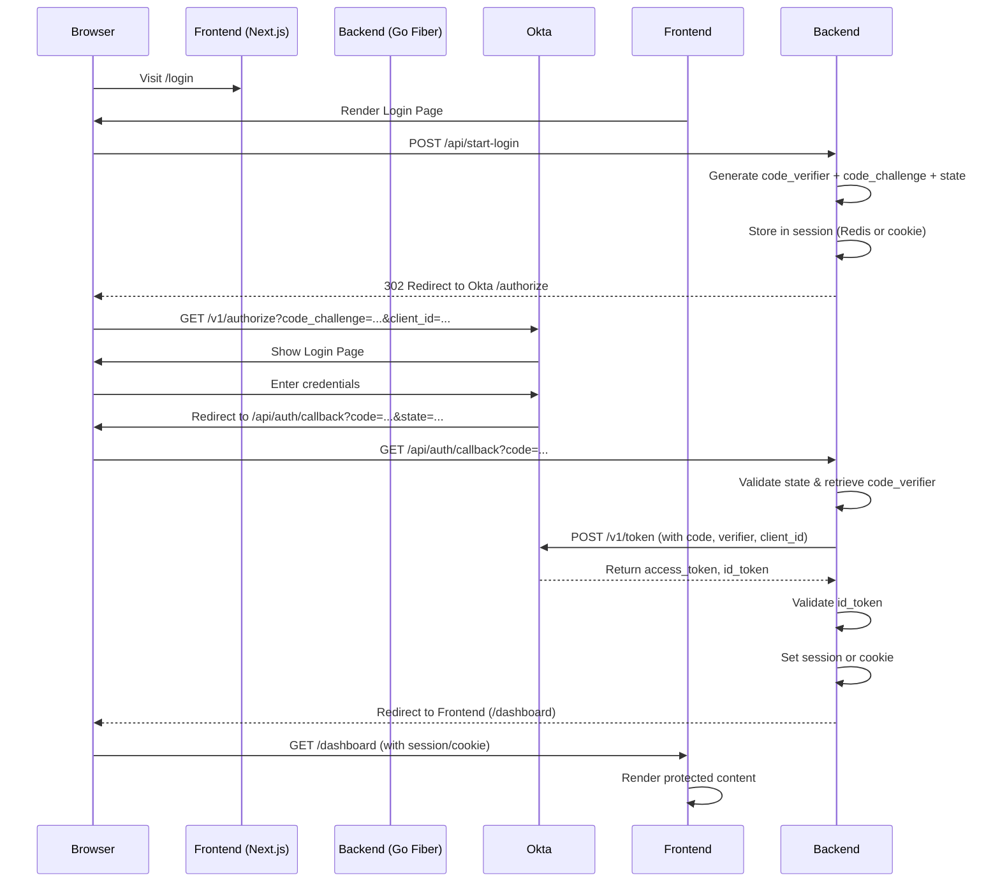

```mermaid
sequenceDiagram
    participant Browser
    participant Frontend (Next.js)
    participant Backend (Go Fiber)
    participant Okta

    Browser->>Frontend (Next.js): Visit /login
    Frontend->>Browser: Render Login Page
    Browser->>Backend: POST /api/start-login
    Backend->>Backend: Generate code_verifier + code_challenge + state
    Backend->>Backend: Store in session (Redis or cookie)
    Backend-->>Browser: 302 Redirect to Okta /authorize

    Browser->>Okta: GET /v1/authorize?code_challenge=...&client_id=...
    Okta->>Browser: Show Login Page
    Browser->>Okta: Enter credentials
    Okta->>Browser: Redirect to /api/auth/callback?code=...&state=...

    Browser->>Backend: GET /api/auth/callback?code=...
    Backend->>Backend: Validate state & retrieve code_verifier
    Backend->>Okta: POST /v1/token (with code, verifier, client_id)
    Okta-->>Backend: Return access_token, id_token
    Backend->>Backend: Validate id_token
    Backend->>Backend: Set session or cookie
    Backend-->>Browser: Redirect to Frontend (/dashboard)

    Browser->>Frontend: GET /dashboard (with session/cookie)
    Frontend->>Frontend: Render protected content
```